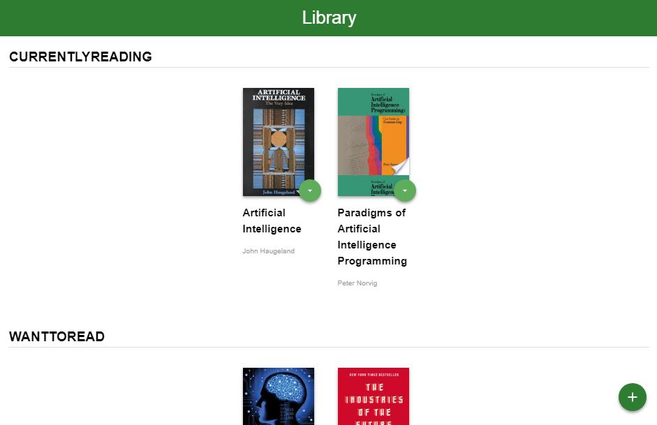
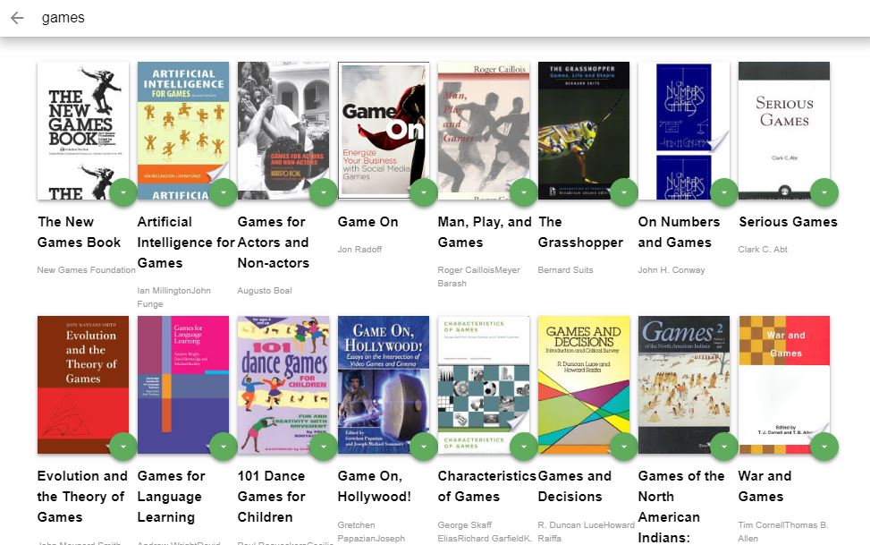

# My Reads App

## Table of Contents

- [About the Project](#about-the-project)
- [Steps to run the Project](#steps-to-run-the-project)
- [Credits](#credits)
- [License](#license)

### About the Project

- Udacity gave an app for books library created with [React](https://reactjs.org/).
- I managed to run the functions in a right way so you can:

1. Search for books in the input by title or authors
2. Move books between different shelves
3. Work on URLs to be updated based on your actions

### Steps to Run The Project

#### Prerequisites

1. Install [Node](https://nodejs.org/en/).
2. npm is bundled with node.

#### Installing The Project

1. Use `Node.js command prompt`.
2. Clone the repository with `git clone https://github.com/MalakJoseph/my-reads-app`.
3. Go to the app directory `cd my-reads-app`.
4. Run `npm install` to install scripts and dependencies of the project.
5. Lastly, run `npm start` to have the project running on `http://localhost:3000/`.
6. **_Enjoy_**.

### Credits

- Code from [Udacity](https://github.com/udacity/reactnd-project-myreads-starter).
- This project was bootstrapped with [Create React App](https://github.com/facebook/create-react-app).

### License

This project is licensed under the terms of the MIT license.
